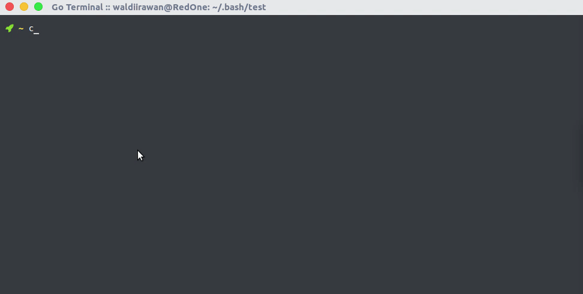
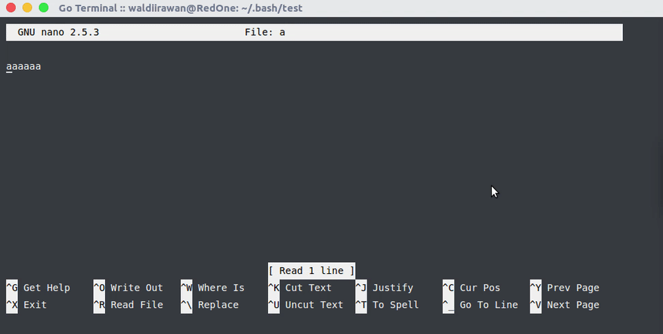
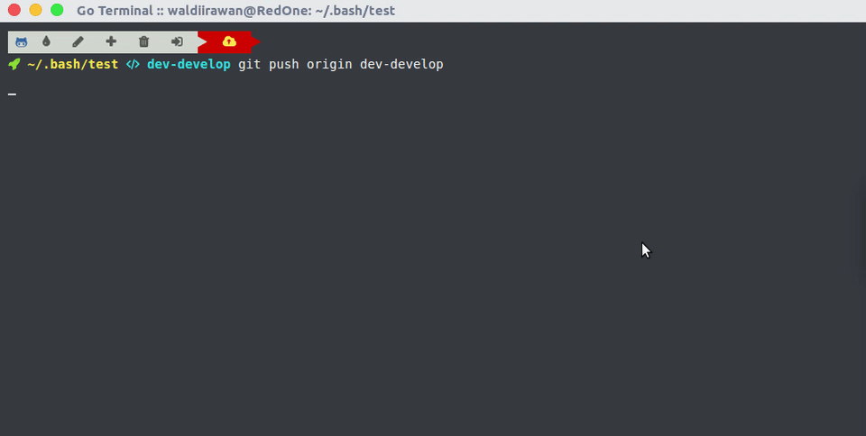

# Git OuterSpace

Menggunakan git melalui terminal ? <br/>
Sering mengecek keadaan project git kamu ? <br/>
dengan git-outerspace inilah kamu bisa lebih care dengan project git kamu

# Pendahuluan

Jika kamu `cd` ke project git direktori kamu,
maka kamu akan melihat branch apa yang sedang kamu gunakan. Kamu juga bisa tau apakah ada file yang untracked (baru ditambahkan), file yang dimodifikasi, file yang dihapus, apakah kamu sudah disarankan commmit atau belum, dan kamu juga bisa tau apakah kamu sudah boleh push ke remote origin atau belum.
Tapi jika kamu berada di direktori yang tidak ada project gitnya maka terminal kamu akan normal normal-normal saja.





  

# Instalasi

Clone git-outerspace.git ke folder .bash di home direktori anda:

```bash
mkdir ~/.bash
cd ~/.bash
git clone git://github.com/waldiirawan/git-outerspace.git
```
Lalu install font-awesome di os anda dan edit `~/.bash_profile` atau `~/.profile` atau `~/.bashrc` (untuk linux) dan copy code dibawah ini ke baris paling atas:

```bash
export GITOUTERSPACE=~/.bash/git-outerspace
source "${GITOUTERSPACE}/main.sh"
```

# Konfigurasi

Setelah terinstal dengan benar, ubah PS1 dengan kode dibawah ini:

Normal Mode :  

```bash
export PS1="$git_bash_prompt\${debian_chroot:+(\$debian_chroot)}\[\033[01;32m\]\u@\h\[\033[00m\]:\[\033[01;34m\]\w\[\033[00m\]\$git_branch\$txtreset \$ "
```

Ikon Mode :

```bash
export PS1="$git_bash_prompt\${debian_chroot:+(\$debian_chroot)}\[\033[01;32m\] \[\033[00m\]\[\033[01;33m\]\w\[\033[00m\]\$git_branch\$txtreset "
```
