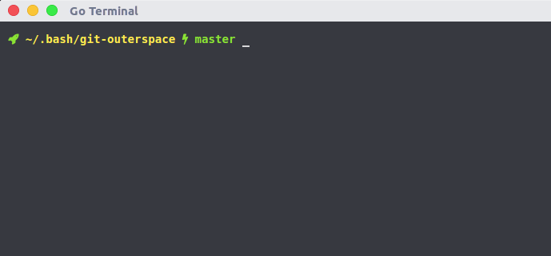
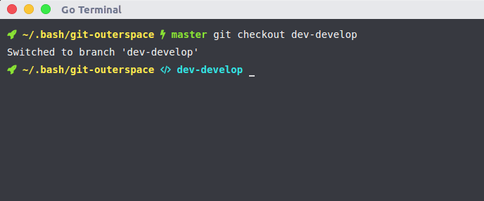
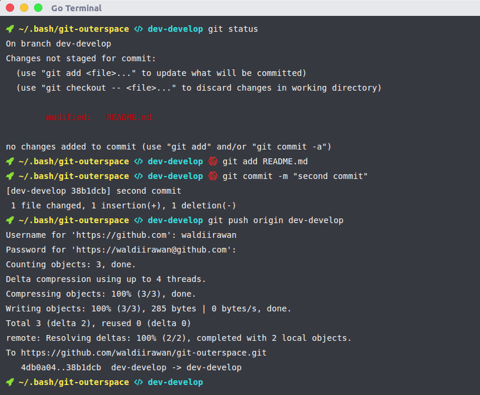

# Git OuterSpace

    Menggunakan git melalui terminal ?
    Sering lupa branch apa yang kamu gunakan ?
    Dengan git-outerspace kamu bisa tau branch apa yang sedang kamu gunakan

# Pendahuluan

    Jika kamu `cd` ke project git direktori kamu,
    maka kamu akan melihat branch apa yang sedang kamu gunakan,
    dan jika kamu berada di direktori yang tidak ada project gitnya maka terminal kamu normal normal-normal saja





  

# Instalasi

    Clone git-outerspace.git ke folder .bash di home direktori anda:

```bash
mkdir ~/.bash
cd ~/.bash
git clone git://github.com/waldiirawan/git-outerspace.git
```
Lalu install font-awesome di os anda dan edit `~/.bash_profile` atau `~/.profile` atau `~/.bashrc` (untuk linux) dan copy code dibawah ini ke baris paling atas:

```bash
export GITOUTERSPACE=~/.bash/git-outerspace
source "${GITOUTERSPACE}/main.sh"
```

# Konfigurasi

    Setelah terinstal dengan benar, ubah PS1 dengan kode dibawah ini:

    Normal Mode :  

```bash
export PS1="\[\033[01;32m\]\u@\h\[\033[00m\]:\[\033[01;34m\]\w\[\033[00m\] \[$txtcyn\]\$git_branch\[$txtred\]\$git_dirty\[$txtreset\] \$ "
```

    Ikon Mode :

```bash
export PS1="\[\033[01;32m\] \[\033[00m\]\[\033[01;33m\]\w\[\033[00m\]\$git_branch\$git_dirty\[$txtreset\] "
```
